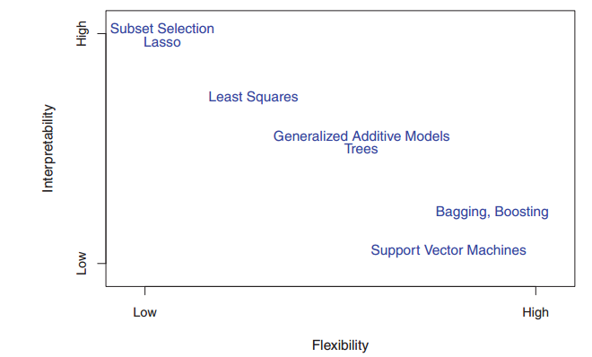

```{r setup, include=FALSE}
knitr::opts_chunk$set(echo = FALSE)
library(dplyr)
library(tidyr)
library(ggplot2)
theme_set(theme_classic(base_size=20))
```

# Models

## Important!

> All models are wrong; some are useful

- None of the models we will investigate will be perfect
- Instead, we'll discuss them in the context of assumptions, strengths, and weaknesses

## Models intended to be covered

- Boosting/Bagging
    - Random Forest
- Ridge Regression/Lasso
    - Regularization
- Support Vector Machines
- Clustering Techniques

## Models we probably won't cover

- Neural Networks
- Bayesian Nonparametrics
- Natural Language Processing

## Flexibility vs Interpretability




# Background

## What is Machine Learning?

\begin{center}
\includegraphics{machine_learning}
\end{center}

## Quick note on Gaussian random variables

```{r gauss}
x <- seq(-3, 3, length.out = 1000)
y <- dnorm(x)
d <- data_frame(x=x, y=y)
ggplot(d, aes(x, y)) + 
    geom_line() + 
    labs(title="Gaussian Probability Density Function",
         caption="Mean: 0\nVariance 1")
```

## Quick note on Bernoulli random variables

```{r bernoulli}
set.seed(1)
p <- 0.25
y <- rbinom(1, 1000, p)
d <- data_frame(x=c("0", "1"), y=c(1000 - y, y))
ggplot(d, aes(x, y)) + 
    geom_col(width=0.5) +
    labs(x="",
         y="Count",
         title="Bernoulli Simulations",
         caption="1,000 Simulations from Bernoulli Random Variable\nProbability of success: 0.25")
```

## Mean/Variance vs Probability

- WLOG we consider the error terms to be either Gaussian or Bernoulli
- Our outcomes will exist in $(-\infty, \infty)$ or in ${0, 1}$.
- For the Gaussian models, we will be interested in the mean (and less so, the variance).
- For the Binomial models, we will *typically* investigate the **probability** of the outcome (even though we observe the binary outcomes), although some models only classify

## Notation

- For the continuous, unbounded outcome case, we will denote the outcome as $$y \sim \text{Gaussian}(\mu, \sigma^2)$$
- Here $\mu$ indicates the mean and $\sigma^2$ indicates the variance
- For the binary outcome case, we will denote the outcome as $$y \sim \text{Binomial}(p)$$
- Here $p$ indicates the probability of observing a "1" and conversely $1-p$ is the probability of observing a "0"

## Multiple observations

- In general, we have more than one observation
- For the continuous case, we are interested in understanding $y_i \sim \text{Gaussian}(\mu_i, \sigma^2)$
- And in the binary case, we are interested in understanding $y_i \sim \text{Binomial}(p_i)$

## Latent function

- Consider $y_i \sim \text{Normal}(\mathbf{f(X_i)}, \sigma^2)$
- Interest is in this *latent function* in order to understand the *data generating process*
    - Aside: we require the latent function to be $f(X_i) = X_i \cdot \beta$ for linear regression
- Binary case: $y_i \sim \text{Bernoulli}(\mathbf{f(X_i)})$

## Data Generating Process

- The *data generating process* (DGP) describes how the latent function (and the error terms) "process" the covariates to the output (observed data)
- For simplicity, most functions will be a polynomial, but I may demonstrate less "nice" latent functions
    - Aside: nice functions rarely describe a data generating process in practice...
- Example: we observe (one dimensional) input $x_i$ and output $y_i$
- $y_i$ is related to $x_i$ via $$y_i \sim \text{Gaussian}((1, x_i, x_i^2, x_i^3) \cdot \beta, \sigma^2)$$

## R example of polynomial DGP

```{r dgp, echo=TRUE}
set.seed(1)
b <- c(-0.1, 0.4, 0.3, .27) # coefficients
n <- 500 # number of observations
x <- runif(n, -5, 5) # simulate random input data
f <- cbind(1, x, x ^ 2, x ^ 3) %*% b # construct func.
y <- rnorm(n, f, sqrt(5)) # simulate with variance 5
```

## Visualization of polynomial DGP

```{r dgp-viz}
d <- data_frame(x=x, f=f[, 1], y=y)
ggplot(d, aes(x=x, y=y)) +
    geom_point(colour="orange", alpha=0.5) +
    geom_line(aes(y=f), colour="blue", size=1.5) +
    labs(title="Polynomial Data Generating Process",
         caption="Observed data as points\nLatent function as line")
```

## A note about the variance

- We will consider $\sigma^2$ to be constant across all observations
    - Known as homoscedastic
- More sophisticated models (which may be considered later) allow for varying $\sigma^2_i$'s
    - Known as heteroscedastic

## Final note

- In many of the machine learning models we investigate, we practically ignore the error terms. 
- We often limit ourselves to making inference on the latent function $f(X_i)$.

# Training, testing, hyperparameters, and philosophy

## Training/Testing

- For fitting a model, we typically split our data into a *training* and *testing* sets.
- We fit to the training data, and then predictions are made on the testing set
    - Provides us with a "practical" sense of how well our model will perform in making predictions on unobserved data
- We expect the model to perform better on the training data than the (held out) test data
    - Examining accuracy in the training data only will generally lead us to be *overconfident* in our model (overfitting)

## Model Selection

- We often use "Mean Squared Error" (MSE) to calculate accuracy
    - Other measures are available as well
- MSE as calculated on the testing is a good method for model selection when *prediction accuracy is the primary concern*
    - Example: testing MSE for model 1 is greater than testing MSE for model 2 $\implies$ model 1 should be used for making predictions

## Hyperparameters

- Many models have so-called "hyperparameters" that do not have a closed form solution or an optimization routine for solving
- Solution of these parameters is *typically* performed by cross-validation on a grid of values within the training set
- Suppose that model A has hyperparameter $\eta$ that must be tuned, and we suppose that it can take values of either 0.1 or 0.01.
- The training data is typically broken further into sub-training and sub-testing sets, and the optimal hyperparameter is chosen based on the sub-testing MSE

## Philosophy

- We will limit ourselves to frequentist models $\Sadey$
    - The "common" techniques in ML our "frequently" frequentist
- Bayesian ML techniques have many advantages, such as a "nicer" method for hyperparameter selection, incorporation of "prior" information, and more sophisticated models that may not exist within a frequentist paradigm
    - Good to be aware of these more advanced approaches, even if we aren't covering them now

# Technology

## R

- Free and open source statistical programming language
- Generally up to date with machine learning techniques
    - For example, random forests were implemented in R ~6 months after initial pape was published. SAS took ~10 years to implement random forests.
- I will predominantly use R for demonstration and labs
- Can be installed from [https://www.r-project.org/](https://www.r-project.org/)

## Python

- Another free and open source programming language
- More general purpose than R
    - Used in many other settings such as system administration in linux, web development, and security
- Often faster performance than R
    - But not as fully featured in terms of statistically driven machine learning techniques
- Better choice for some machine learning techniques, such as neural networks

## R and Python in harmony

- Often, data science shops will use R to develop and test models in prototyping
- Problem: you would like to provide a dashboard to a network of hospitals to predict probably of an adverse event for a new patient
- R could be used to explore/prototype models
- Python could be used for the production model making predictions/learning from new observations

