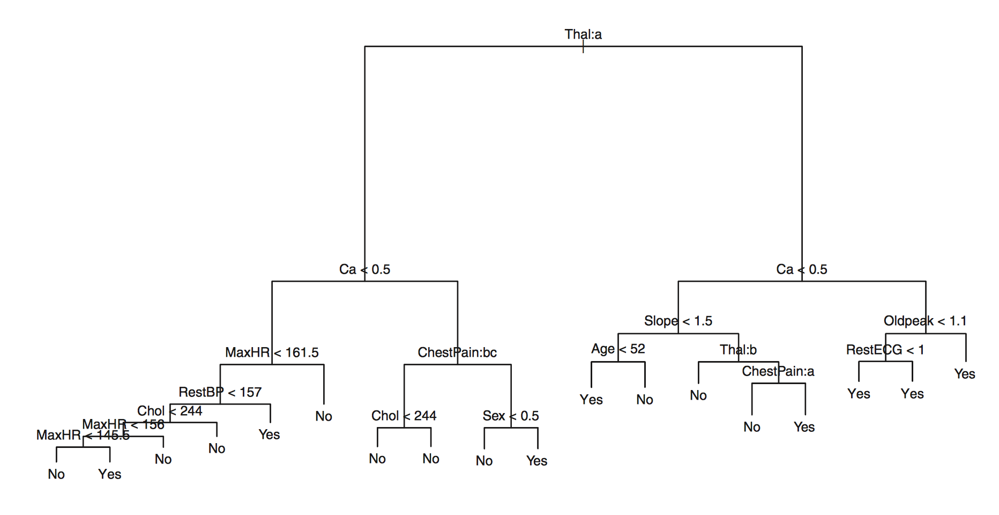

```{r setup, include=FALSE}
knitr::opts_chunk$set(echo = FALSE)
library(dplyr)
library(tidyr)
library(ggplot2)
theme_set(theme_classic(base_size=20))
```

# Reminders

## Latent function

- Consider $y_i \sim \text{Normal}(\mathbf{f(X_i)}, \sigma^2)$
- Interest is in this *latent function* in order to understand the *data generating process*
    - Aside: we require the latent function to be $f(X_i) = X_i \cdot \beta$ for linear regression

## R example of polynomial DGP

```{r dgp, echo=TRUE}
set.seed(1)
b <- c(-0.1, 0.4, 0.3, .27, 0.51) # coefficients
n <- 500 # number of observations
x <- runif(n, -5, 5) # simulate random input data
f <- cbind(1, x, x ^ 2, x ^ 3, x ^ 4) %*% b # func.
y <- rnorm(n, f, sqrt(200)) # simulate with variance 200
```

## Visualization of polynomial DGP

```{r dgp-viz}
d <- data_frame(x=x, f=f[, 1], y=y)
ggplot(d, aes(x=x, y=y)) +
    geom_point(colour="orange", alpha=0.5) +
    geom_line(aes(y=f), colour="blue", size=1.5) +
    labs(title="Polynomial Data Generating Process",
         caption="Observed data as points\nLatent function as line")
```

# CART

## Terminology

```{r term-example}
library(tree)
mod.lm <- lm(y ~ x)
mod.tree <- tree(y ~ x)

plot(mod.tree)
text(mod.tree, pretty=0)
```

## Classification Tree



## Partitions

\begin{figure}
\hfill
\subfigure{\includegraphics[width=5cm]{hitter-tree.png}}
\hfill
\subfigure{\includegraphics[width=5cm]{partition.png}}
\hfill
\end{figure}

## Algorithm

- Goal is to find partitions $R_1, ..., R_J$ such that we minimize the RSS
  $$\sum_{j=1}^J\sum_{i \in R_j} (y_i - \hat{y}_{R_j})^2$$
- Perform binary splitting by selecting an $X_j$ and cutpoint $s$ such that arising regions $R_1$ and $R_2$ and values $\hat{y}_{R_1}$ and $\hat{y}_{R_2}$ minimize the RSS
- $\hat{y}_{R_j}$ is calculated as mean response for observations in region $R_j$
- Continue splitting each region until stopping point is reached

## Hyperparameters and Tuning

- Typically, tree constructed in this fashion will be overfit
- Next step involves *pruning* the tree to obtain a subtree
- Resulting subtree will have less variance at the cost of some bias
    - Aside: the number of terminal nodes is a hyperparameter in CART

## Latent functions again

>- Consider $y_i \sim \text{Normal}(\mathbf{f(X_i)}, \sigma^2)$
>- We require the latent function to be $f(X_i) = X_i \cdot \beta$ for linear regression
>- Latent function for regression tree is $f(X_i) = \sum_{j=1}^J c_j \cdot 1_{(X_i \in R_j)}$

## Final Notes

>- CART is our first example of a *non-linear* model
>- Even easier to explain/interpret than linear regression
>- Easy to overfit, espeically without tuning
>- However, CART is the basis for many ensemble models

# Examples

## Training
```{r training, echo=TRUE}
training <- sample(0:1, floor(n * 0.7), TRUE)

library(tree)
mod.tree <- tree(y ~ x, subset=training == 1)

d <- data.frame(x[training == 0], y[training == 0])
names(d) <- c("x", "y")

pred.tree <- predict(mod.tree, d)
```

## Prediction

```{r example}
d <- data_frame(x=d$x, 
                observed=d$y,
                tree=pred.tree) %>%
    gather(key, value, observed:tree)

ggplot(d, aes(x, value)) + 
    geom_line(aes(colour=key,
                  linetype=key))
```

## Tuning

```{r tuning}
cv.mod <- cv.tree(mod.tree)
cv.data <- data.frame(size=cv.mod$size,
                      dev=cv.mod$dev)
ggplot(cv.data, aes(x=size, y=dev)) +
    geom_point() +
    xlab("Terminal Nodes") +
    ylab("Deviance")
```

## Complicated Latent Function

```{r nn}
set.seed(1)
sigmoid <- function(z) {
    return(1 / (1 + exp(-z)))
}
std <- 1.1

sizes <- c(1, rep(100, 100), 1)
num.layers <- length(sizes)
biases <- lapply(sizes[2:length(sizes)], rnorm, sd=std)
weights <- apply(cbind(sizes[1:(num.layers-1)], sizes[2:num.layers]), 1,
                 function(x) matrix(rnorm(x[2] * x[1], sd=std), x[2], x[1]))

feedforward <- function(a, biases, weights) {
    for (layer in mapply(list, biases, weights, SIMPLIFY=FALSE)) {
        b <- layer[[1]]
        w <- layer[[2]]
        
        a <- sigmoid(w %*% a + b)
    }
    
    return(a)
}

f <- sapply(x, feedforward, biases, weights)
f <- log(f / (1 - f))
y <- rnorm(n, f, 0.15)
d <- data_frame(x=x, 
                f=f,
                y=y) 

ggplot(d, aes(x=x, y=y)) +
    geom_point(colour="orange", alpha=0.5) +
    geom_line(aes(y=f), colour="blue", size=1.5) +
    labs(title="Deep Neural Network Data Generating Process",
         caption="Observed data as points\nLatent function as line")
```

## Compare RT and LM on NN Latent Function

```{r fitting-nn}
mod.lm <- lm(y ~ x)
mod.tree <- tree(y ~ x)

pred.lm <- fitted(mod.lm)
pred.tree <- predict(mod.tree)

d1 <- data_frame(x=x, 
                 lm=pred.lm, 
                 tree=pred.tree) %>% 
    gather(key, value, lm:tree)

ggplot(d1, aes(x, value)) + 
    geom_line(aes(colour=key,
                  linetype=key),
              size=1.3) +
    geom_point(data=d, colour="orange", alpha=0.5, aes(y=y)) + 
    geom_line(data=d, colour="blue", size=1.5, aes(y=f))
```
